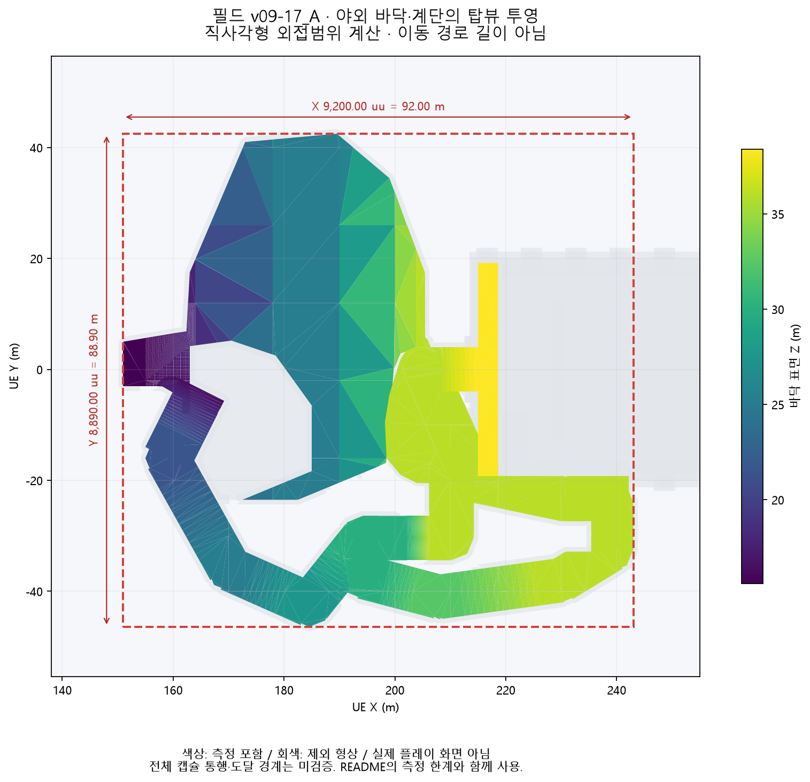
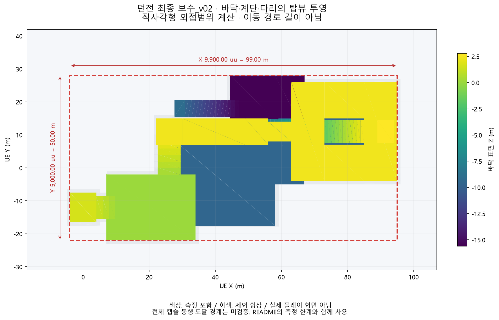

> 이 보고서와 PDF는 제출 연결 변경 전 조사입니다. 원본 프로젝트에 대한 당시 시작·연결 맵 설명은 그대로 보존하며, 이후 적용·검증한 제출 설정은 [제출 보고서](../Submission/README.md)에 있습니다.

# UE5 포트폴리오 제출 전 검수

검수일: 2026-09-27. 프로젝트·맵·블루프린트·기존 로그·엑셀은 수정하거나 저장하지 않았다. 원본 프로젝트 1,512개 파일의 SHA-256이 기존 보존 기록과 모두 같다. 기존 작업용 복사본에서 추가 자산 읽기만 수행했고, 읽은 맵3개의 원본/복사본 해시도 일치한다. 신규 플레이테스트는 하지 않았다.

**제출 전 주의할 차이:** 실제 필드 연결 대상은 `던전내부최종`이며 `던전내부최종_보수_v02`가 아니다. 기본 실행 맵은 별도 구버전이다. 현재 스폰박스 기준 거리는 문서1,860 uu와 다른1,900 uu다. 16:9는 강제 화면비가 아니다. 필드 비율들의 원집계는 현재 자료로 재검증할 수 없다.

분류에서 **설정**은 자산/코드 및 기존 런타임 캡처의 적용값, **계산**은 형상·좌표·공식으로 도출한 값이다. **기존 실측 기록**은 작업노트에 남은 과거 결과를 뜻하며 이번에 새로 실측하거나 원로그를 전부 재검증했다는 뜻이 아니다. 이번 자산 읽기에서 저장/컴파일/PIE 실행은 하지 않았다. 런타임 근거는 앞선 내보내기 작업에서 확보한 2026-09-26 캡처다.

## 1. 맵 크기와 버전

| 항목 | 확인 결과 | 근거 파일·블루프린트·로그 위치 | 설정·계산·실측 구분 | 문서에 넣을 짧은 문장 |
|---|---|---|---|---|
| 최종 맵 이름·버전 | 필드: /Game/Portfolio02/Levels/던전외부필드_v09-17_A. 던전 검수 대상: /Game/Portfolio02/Tests/FinalBossCandidates/던전내부최종_보수_v02(보관된 가장 뒤 보수번호). 필드 실제 전환 대상은 보수 접미사 없는 던전내부최종. 이 세 이름을 하나의 최종 버전으로 쓰면 안 된다. Git HEAD f315d8c0, 2026-09-16. 작업노트의 v17 변경일은 2026-09-14. | [작업노트 L2462](<../Portfolio02_Entrance_Design_Log.md>); [asset-readback.json](<asset-readback.json>) | 설정·버전 기록 | 필드 v09-17_A와 던전 보수_v02를 검수했으며, 현재 필드 연결 대상은 던전내부최종이다. |
| 기본 실행 맵 | Config의 EditorStartupMap·GameDefaultMap은 L_Entrance_v03. v17을 프로젝트 기본 실행 맵이라고 할 수 없다. 이번 검수는 해당 최종 후보 맵을 명시적으로 지정한 자료에 한정한다. | [DefaultEngine.ini](<../../Config/DefaultEngine.ini>) | 설정 | 최신 필드와 기본 실행 맵 설정은 별도로 관리되어 있다. |
| 단위 기준 | 필드·연결 던전·보수_v02 모두 WorldToMeters=100. 좌표 환산은 100 uu=1 m, 1 uu=1 cm로 사용. 모델/액터 스케일을 적용한 월드 좌표를 측정했다. 실제 건축물과의 물리적 크기 대조는 수행하지 않았다. | [asset-readback.json](<asset-readback.json>); [field-actors.json](<../../web-export/evidence/field-actors.json>); [dungeon-actors.json](<../../web-export/evidence/dungeon-actors.json>) | 설정 + 단위 환산 | 프로젝트의 공간 치수는 100 uu=1 m 기준으로 환산했다. |
| 필드 X·Y 범위 / 높이 차 | 선택한 야외 바닥·계단 충돌면 83개 액터 기준: X=15,100~24,300 uu(151~243 m), Y=−4,640~4,250 uu(−46.4~42.5 m). 외접 직사각형 9,200×8,890 uu=92×88.9 m. 보행면 Z=1,560~3,840 uu(15.6~38.4 m), 높이 차 2,280 uu=22.8 m. 전체 캡슐 도달가능영역의 정확한 경계는 확인 불가. 이 수치를 플레이 영역 전수 실측으로 쓰지 말 것. | [map-dimensions.json](<map-dimensions.json>); [measurement-selection.csv](<measurement-selection.csv>); [field-collision-geometry.json](<../../web-export/evidence/field-collision-geometry.json>) | 계산값(선택한 충돌 형상 기준), 전체 통행 실측 아님 | 야외 바닥·계단 형상의 외접범위는 약 92×88.9 m, 표면 고저차는 22.8 m이다(전체 통행 경계 미검증). |
| 던전 X·Y 범위 / 높이 차 | 보수_v02의 바닥·계단·다리 74개 액터 기준: X=−400~9,500 uu(−4~95 m), Y=−2,200~2,800 uu(−22~28 m). 외접 직사각형 9,900×5,000 uu=99×50 m. 보행면 Z=−1,560~280 uu(−15.6~2.8 m), 높이 차 1,840 uu=18.4 m. 다리·계단 기믹으로 순차 접근하는 공간을 합친 범위다. 상태별 캡슐 도달가능영역 및 연결 대상 원본 던전의 전체 치수는 확인 불가. | [map-dimensions.json](<map-dimensions.json>); [measurement-selection.csv](<measurement-selection.csv>); [dungeon-collision-geometry.json](<../../web-export/evidence/dungeon-collision-geometry.json>) | 계산값(선택한 충돌 형상 기준), 전체 통행 실측 아님 | 던전 보수_v02 바닥·계단 형상의 외접범위는 약 99×50 m, 표면 고저차는 18.4 m이다(전체 통행 경계 미검증). |
| 측정 제외·탑뷰·이동 거리 구분 | 하늘·조명·벽·난간·지붕·수면·호수 밑바닥·분수 등 장식·계단 하부 받침 제외. 필드는 전환 후 성당 내부 플랫폼 4개와 다른 바닥의 내부 연장분도 제외. 선택 목록과 절삭 기준을 별도 저장했다. 그림은 충돌 형상의 직교 투영으로 실제 플레이 캡처가 아니다. 불규칙한 바닥을 감싼 직사각형이므로 빈 공간을 포함한다. 경로의 누적 이동 거리와 다르다. | [field-bounds.png](<field-bounds.png>); [dungeon-bounds.png](<dungeon-bounds.png>); [measurement-selection.csv](<measurement-selection.csv>) | 계산·시각화 | 맵 크기는 불규칙한 보행 바닥을 감싸는 직사각형 기준이며 이동 경로 길이와 구분했다. |

## 2. 카메라·이동 설정

| 항목 | 확인 결과 | 근거 파일·블루프린트·로그 위치 | 설정·계산·실측 구분 | 문서에 넣을 짧은 문장 |
|---|---|---|---|---|
| 필드 실제 카메라 | 기존 PIE 초기 캡처의 활성 MCP_TEST_QuarterViewCameraRig: Pitch −50°, Yaw 0°, Roll 0°, 거리 2,000 uu, Perspective FOV 45°. Pawn 중심→Camera 상대 벡터 (−1,285.575,0,+1,532.089) uu, 길이 2,000 uu. 지면으로부터 높이 2,000 uu라는 뜻이 아니다. | [field-runtime-initial.json](<../../web-export/evidence/field-runtime-initial.json>); [P02PlaytestSystem.cpp L1884](<../../Source/P02Dungeon/P02PlaytestSystem.cpp>); [P02PlaytestSystem.cpp L1955](<../../Source/P02Dungeon/P02PlaytestSystem.cpp>) | 런타임 적용 설정 관측 + 벡터 계산 | 필드 플레이 카메라는 Pitch −50°, 추적 거리 2,000 uu, 수평 FOV 45°의 고정 쿼터뷰다. |
| 던전 실제 카메라 | 보수_v02 기존 PIE 초기 캡처도 활성 Rig의 Pitch −50°, Yaw 0°, 거리 2,000 uu, FOV 45°로 필드와 일치. 보수 접미사 없는 실제 연결 던전은 동일 GameMode·공통 소스 사용과 시작 위치만 이번 자산 읽기로 확인. 그 맵의 별도 런타임 카메라 캡처는 확인 불가. | [dungeon-runtime-initial.json](<../../web-export/evidence/dungeon-runtime-initial.json>); [asset-readback.json](<asset-readback.json>); [P02PlaytestSystem.cpp L1955](<../../Source/P02Dungeon/P02PlaytestSystem.cpp>) | 런타임 적용 설정 관측(보수_v02) / 연결 원본은 설정 확인 | 던전 보수_v02의 런타임 카메라도 필드와 같은 −50°·2,000 uu·45°를 적용한다. |
| BP 기본값과 활성 카메라 차이 | BP_CombatCharacter의 Camera 템플릿 FOV=90°, 회전=0°. Camera Boom 템플릿 ArmLength=100 uu, 상대 위치=(0,40,70) uu, 카메라 충돌·Lag=true. 이 카메라는 실제 쿼터뷰의 ViewTarget이 아니다. 런타임 소스가 별도 네이티브 Rig를 생성하고 SetViewTarget으로 교체한다. BP 기본 카메라 값을 쿼터뷰 값으로 인용하면 틀린다. | [asset-readback.json](<asset-readback.json>); [P02PlaytestSystem.cpp L1955](<../../Source/P02Dungeon/P02PlaytestSystem.cpp>); [field-runtime-initial.json](<../../web-export/evidence/field-runtime-initial.json>) | BP 설정 vs 런타임 적용 설정 | 블루프린트 기본 카메라 대신 런타임 전용 쿼터뷰 카메라를 사용한다. |
| 화면비 16:9 | 두 활성 카메라의 AspectRatio≈1.777778이나 ConstrainAspectRatio=false. 16:9가 강제되는 설정은 아니다. 기존 참가자 영상은 작업노트상 1920×1080/60fps지만 원영상 미보관으로 재검증 불가. 현재 PIE 실제 렌더 화면 크기 및 FOV 축 유지 방식까지는 캡처에 없어 확인 불가. 45°는 CameraComponent의 FOV 설정값으로 확인한 것. | [field-runtime-initial.json](<../../web-export/evidence/field-runtime-initial.json>); [dungeon-runtime-initial.json](<../../web-export/evidence/dungeon-runtime-initial.json>); [작업노트 L2306](<../Portfolio02_Entrance_Design_Log.md>) | 설정 / 녹화 규격은 기존 기록 | 카메라 FOV는 45°이며, 16:9는 기존 녹화 규격이다. 화면비 강제 설정은 사용하지 않는다. |
| 이동속도·회전·단차 | 필드·보수_v02 Pawn 런타임 MaxWalkSpeed=400 uu/s(4 m/s). BP CDO도 400. 순간 실속도나 장애물 포함 평균 이동속도 실측은 아니다. MaxStepHeight=45 uu, WalkableFloorAngle≈44.765°, 캡슐 반경35/반높이90 uu. BP JumpZVelocity420→런타임0, OrientRotationToMovement false→true, Yaw 회전율360→720°/s. | [BP_CombatCharacter-defaults.json](<../../web-export/evidence/BP_CombatCharacter-defaults.json>); [field-runtime-initial.json](<../../web-export/evidence/field-runtime-initial.json>); [dungeon-runtime-initial.json](<../../web-export/evidence/dungeon-runtime-initial.json>); [P02PlaytestSystem.cpp L1934](<../../Source/P02Dungeon/P02PlaytestSystem.cpp>) | 기본 설정 vs 런타임 적용 설정 | 기본 보행 최대속도는 400 uu/s(4 m/s)이며, 점프를 끄고 이동 방향으로 캐릭터가 회전한다. |
| 충돌·오프셋·대시 조건 | 활성 Rig는 Pawn 중심 추적, SpringArm 절대 회전, 회전 상속 없음, CameraLag=false, DoCollisionTest=false. 충돌에 따른 카메라 거리 단축을 사용하지 않는다. 대시 수치 450 uu/1,600 uu/s/재사용0.8초는 남아 있으나 bDashPressed=false로 현재 진입이 차단되어 있다. 이 사실로 과거 테스트의 대시 사용 여부까지 부정할 수 없다. | [P02PlaytestSystem.cpp L250](<../../Source/P02Dungeon/P02PlaytestSystem.cpp>); [P02PlaytestSystem.cpp L429](<../../Source/P02Dungeon/P02PlaytestSystem.cpp>); [P02PlaytestSystem.cpp L2068](<../../Source/P02Dungeon/P02PlaytestSystem.cpp>); [P02PlaytestSystem.cpp L78](<../../Source/P02Dungeon/P02PlaytestSystem.cpp>) | 설정·코드 구현 확인 | 현재 쿼터뷰는 카메라 충돌 보정을 사용하지 않으며, 대시 입력은 비활성화되어 있다. |

## 3. 필드 플레이테스트 집계

| 항목 | 확인 결과 | 근거 파일·블루프린트·로그 위치 | 설정·계산·실측 구분 | 문서에 넣을 짧은 문장 |
|---|---|---|---|---|
| 전체 8명·15판 | 2026-09-10 작업노트에 T01~T08 8명·15판, 자유 탐색8/지시7로 명시되어 있다. 원본45개 파일 해시 확인 사실도 문서에 남아 있다. 그러나 현재 저장소에는 참가자별 원시 좌표·이벤트 로그와 연결된 분석 결과 폴더가 없어 직접 재집계는 확인 불가. “원기록을 이번에 직접 집계한 수치”라고 쓰면 안 된다. | [작업노트 L2292](<../Portfolio02_Entrance_Design_Log.md>); [missing-references.json](<missing-references.json>) | 기존 집계 기록 확인; 원자료 재집계 불가 | 기존 테스트 정리에는 8명·15판(자유 탐색8판, 지시7판)으로 기록되어 있다. |
| 최초 선택 분석 8명 / 25%·75% | 자유 탐색8판이라는 구성은 기록되어 있으나 “최초 선택 분석”의 실제 참가자 목록·첫 선택 이벤트·좌우 판정 경계·분자/분모·25%/75% 원표는 확인 불가. 8명을 분모로 가정해 2명/6명으로 역산한 값을 실집계 인원으로 쓰지 않는다. | [작업노트 L2295](<../Portfolio02_Entrance_Design_Log.md>); [workbook-readback.json](<workbook-readback.json>); [missing-references.json](<missing-references.json>) | 확인 불가 | 최초 선택 비율은 참가자별 원기록 대조 전까지 확정하지 않았다. |
| 기둥 정방향 접근 71.4%·28.6% | 현재 문서·CSV/TSV·Excel 및 보관된 추출 자료에서 해당 집계 원표를 확인하지 못했다. 대상이 참가자인지 접근 사건인지, 각 분자·분모, 포함 회차, 중복 처리, 정방향의 좌표/각도 정의, 제외 조건 모두 확인 불가. 5/7명으로 단정하지 않는다. | [missing-references.json](<missing-references.json>); [workbook-readback.json](<workbook-readback.json>); [작업노트 L2292](<../Portfolio02_Entrance_Design_Log.md>) | 확인 불가 | 기둥 정방향 접근 비율은 분모·판정 기준의 원기록을 확보하지 못해 확정하지 않았다. |
| 회차·중복·제외 규칙 | 전체8명·15판 구성의 기록: T01 연습1건 제외, 본 테스트2판 포함(첫 판 대시는 제외 사유 아님). T06은 양쪽 경로를 한 판에서 수행해 자유 탐색1판만 유지, 가상 R2 생성 금지. T08 재시작 보정 적용이나 세부 병합 규칙은 미보관. 영상 T00·다른 날짜 제외. T01 영상 시작 이전 약5초는 복원하지 않고 참가자는 유지. 이 규칙이 각 질문의 비율 분모에도 동일하게 적용되었는지는 확인 불가. | [작업노트 L2295](<../Portfolio02_Entrance_Design_Log.md>); [작업노트 L2301](<../Portfolio02_Entrance_Design_Log.md>); [작업노트 L2306](<../Portfolio02_Entrance_Design_Log.md>) | 기존 집계/제외 규칙 기록 | 전체 집계는 T01 본 테스트와 T06 단일 회차를 포함하며, 연습 및 대상 외 영상은 제외했다(개별 비율 분모는 미확인). |
| 호수: 수면 5% 이상 참가자100% | 당시 좌표 로그에 카메라·화면 노출 정보가 없다고 명시되어 있다. 100개 표본은 참가자 균형을 고려한 검토용 선택이며 노출률 추정용 확률표본이 아니다. 원영상·프레임별 수면 마스크·화면 분모(HUD/레터박스 포함 여부)·5% 지속시간/최소프레임·참가자별 판정표가 없다. 따라서 100%의 분자·분모와 판정 방식은 확인 불가. | [작업노트 L2296](<../Portfolio02_Entrance_Design_Log.md>); [작업노트 L2298](<../Portfolio02_Entrance_Design_Log.md>); [작업노트 L2308](<../Portfolio02_Entrance_Design_Log.md>) | 확인 불가 | 수면 화면 점유율 5% 이상 경험 비율은 원영상 판정표가 없어 확정하지 않았다. |
| 호수: 반사 단서 반응0% | 반사 인지/반응을 좌표나 해당 구역 도달만으로 확정할 수 없다. 무엇을 반응으로 코딩했는지(발언·입력·접근 변화), 관찰 창과 참가자별 결과가 미보관이므로 0% 확인 불가. v09-9 같은 좌표의 화면 점유율8.1→6.3%,14.1→11.2%는 색상 근사 기술 비교이며 참가자 전체의 노출/반사 인식률이 아니다. | [작업노트 L2298](<../Portfolio02_Entrance_Design_Log.md>); [작업노트 L2309](<../Portfolio02_Entrance_Design_Log.md>); [작업노트 L2397](<../Portfolio02_Entrance_Design_Log.md>) | 확인 불가; 별도 기술 비교 기록 존재 | 반사 단서의 인지·반응률은 좌표만으로 판단하지 않았으며 원영상 기준의 재검토가 필요하다. |

## 4. 몬스터 도달·문 상호작용

| 항목 | 확인 결과 | 근거 파일·블루프린트·로그 위치 | 설정·계산·실측 구분 | 문서에 넣을 짧은 문장 |
|---|---|---|---|---|
| 거리1,860 uu 대조 | 문서: 스폰박스 서쪽 X4,440→문 중심X6,300=1,860 uu. 현재 보수_v02 PIE 캡처: Spawn 중심(4,600,1,100,340), BoxExtent40×Scale(5,8,4)=(200,320,160), 서쪽X4,400/동쪽X4,800. 소스는 GetComponentsBoundingBox(true)의 Min.X에 생성하므로 문 중심까지 현재 수평 거리는1,900 uu(19 m). 연결 원본 던전도 이번 읽기에서 같은 Bounds 확인. 문서의 서쪽면 좌표와 불일치하며 변경 원인은 확인 불가. | [Portfolio02_UsedMetrics.csv](<../Portfolio02_UsedMetrics.csv>); [dungeon-runtime-initial.json](<../../web-export/evidence/dungeon-runtime-initial.json>); [asset-readback.json](<asset-readback.json>); [P02PlaytestSystem.cpp L1597](<../../Source/P02Dungeon/P02PlaytestSystem.cpp>) | 설정 관측 + 좌표 계산; 실이동 측정 아님 | 현재 맵의 스폰 서쪽면부터 문 중심까지 수평 거리는1,900 uu이며 문서의1,860 uu와 차이가 있다. |
| 4.17초의 의미 | 문서 조건 계산: (1,860−150)/410=4.1707317초. 현재 좌표 대입: (1,900−150)/410=4.2682927초. 모두 플레이어가 문 중심에 정지하고 장애물 없이 속도410을 유지한다는 이상적인 사거리 진입 이동시간. 첫 생성 트리거부터 실제 피격 또는 E 홀드 시작부터의 총시간이 아니다. 피격 실측값으로 표기하면 안 된다. | [Portfolio02_UsedMetrics.csv](<../Portfolio02_UsedMetrics.csv>); [P02PlaytestSystem.cpp L563](<../../Source/P02Dungeon/P02PlaytestSystem.cpp>); [P02PlaytestSystem.h L427](<../../Source/P02Dungeon/P02PlaytestSystem.h>) | 계산값 | 약4.17초는 문서 거리1,860 uu를 대입한 단순 이동 계산값이며, 현재 좌표 기준 계산은 약4.27초다. |
| 생성 트리거와 문 상호작용 | 플레이어 X≥스폰박스 Max.X(현재4,800)가 되는 Tick에서 최초 추격자 즉시 생성. 해당 조건에 Y/Z, E 입력, 문 홀드 시작 검사는 없다. 문 홀드는 문 중심과 2D거리≤250 uu이고 E를 누른 동안 별도 누적한다. 적은 문 자체가 아닌 플레이어를 추적하므로 E를 누를 때 이미 이동 중일 수 있다. | [P02PlaytestSystem.cpp L1650](<../../Source/P02Dungeon/P02PlaytestSystem.cpp>); [P02PlaytestSystem.cpp L1710](<../../Source/P02Dungeon/P02PlaytestSystem.cpp>); [P02PlaytestSystem.h L414](<../../Source/P02Dungeon/P02PlaytestSystem.h>) | 코드 구현 + 설정 | 추격자는 문 조작 전에 스폰박스 동쪽선을 넘으면 생성되며, 문 개방은 별도의 E 홀드로 시작된다. |
| 0.1초 지연의 기준 | RespawnDelay=0.1초는 최초 스폰 지연이 아니다. Gate Tick이 현재 추격자의 소멸/HP≤0을 처음 확인하면 타이머를 설정하고, 다음 Tick들에서 DeltaSeconds를 빼서 재생성한다. 사망 이벤트 순간과 감지 Tick 사이 지연, 프레임 단위 양자화가 있다. 다리 파괴 시 추격 종료를 고정하고 적을 제거하며, 다리를 복구해도 추격은 재개되지 않는다. | [P02PlaytestSystem.cpp L1663](<../../Source/P02Dungeon/P02PlaytestSystem.cpp>); [P02PlaytestSystem.cpp L1679](<../../Source/P02Dungeon/P02PlaytestSystem.cpp>); [P02PlaytestSystem.h L423](<../../Source/P02Dungeon/P02PlaytestSystem.h>) | 코드 구현 + 설정 | 0.1초는 추격자 사망 감지 후 재생성 대기값이며 최초 생성 지연이 아니다. |
| 이동→사거리→공격→피격 | 현재 EnemyMoveSpeed410 uu/s, AttackRange150 uu(플레이어 중심과 수평거리), AttackDamage10. 매 Tick 직선 방향으로 Sweep 이동하고 이동 분기에서 return한다. 사거리 도달 후 다음 적 Tick에서 공격 조건 평가. NextAttackTime 초기0이므로 첫 공격에1.5초 선대기는 없고, 별도 애니메이션 선딜 없이 ApplyPlayerDamage를 같은 호출에서 수행한다. AttackCooldown1.5초는 후속 공격 간격이다. 실제 프레임 간격과 첫 HP 감소 시각은 확인 불가. | [P02PlaytestSystem.cpp L548](<../../Source/P02Dungeon/P02PlaytestSystem.cpp>); [P02PlaytestSystem.h L133](<../../Source/P02Dungeon/P02PlaytestSystem.h>); [P02PlaytestSystem.h L157](<../../Source/P02Dungeon/P02PlaytestSystem.h>); [P02PlaytestSystem.cpp L1616](<../../Source/P02Dungeon/P02PlaytestSystem.cpp>) | 코드 순서·설정; 피격 시점 실측 불가 | 사거리 진입 후 다음 공격 판정 Tick에서 피해를 적용하며, 첫 피격의 실제 시각은 별도 실측하지 않았다. |
| 직선 거리와 실제 경로·기존 실측 | 추격은 NavMesh 경로 탐색이 아니라 매 Tick 현재 플레이어 방향의 Sweep 이동이다. 장애물·플레이어 이동에 따라 누적 경로가 달라진다. 현재410 설정의 이동 시작/사거리 진입/첫 피격 원로그는 확보하지 못했다. 작업노트의6.62초/1,799 uu는 과거 속도250 조건으로 이번 조건에 전용할 수 없다. 소스 MEASURED 로그의 거리도 스폰→피격 시 플레이어의 2D직선거리이며 누적 이동 거리가 아니다. HP 감소와 추격자 존재를 함께 검사할 뿐 피해 원인 액터를 분리하지 않아 로그만으로 추격자의 타격임을 보증하지 않는다. | [작업노트 L838](<../Portfolio02_Entrance_Design_Log.md>); [P02PlaytestSystem.cpp L1699](<../../Source/P02Dungeon/P02PlaytestSystem.cpp>); [P02PlaytestSystem.cpp L563](<../../Source/P02Dungeon/P02PlaytestSystem.cpp>) | 과거 실측 기록(다른 조건) / 현재 실측 확인 불가 | 현재410 uu/s 조건의 실제 추격 경로 길이와 최초 피격 시간은 확인되지 않았다. |
| 문 개방 취소·완료 조건 | 미개방 상태에서 E 해제 또는 문 중심의 수평250 uu 범위 이탈 시 HoldElapsed=0. 직전 Gate Tick보다 HP가 감소했고 HoldElapsed>0이면0으로 초기화. 단순 공격 모션이나 피격 이벤트 자체가 아니라 비교 시점의 HP 감소 조건이다. 5초 누적 완료 시 문 충돌 즉시 해제·추격자 제거, 이후1초 동안620 uu 하강/페이드 후 숨김. 다리 파괴가 문 홀드의 필수 조건으로 들어가 있지는 않다. | [P02PlaytestSystem.cpp L1648](<../../Source/P02Dungeon/P02PlaytestSystem.cpp>); [P02PlaytestSystem.cpp L1710](<../../Source/P02Dungeon/P02PlaytestSystem.cpp>); [P02PlaytestSystem.cpp L1736](<../../Source/P02Dungeon/P02PlaytestSystem.cpp>); [P02PlaytestSystem.cpp L1768](<../../Source/P02Dungeon/P02PlaytestSystem.cpp>); [dungeon-runtime-initial.json](<../../web-export/evidence/dungeon-runtime-initial.json>) | 코드 구현 + 런타임 설정 | 문은 범위 내 E를5초 유지하면 열리며, 키 해제·범위 이탈·진행 중 HP 감소로 개방 진행이 초기화된다. |

## 5. 경로별 시간의 측정 조건

| 항목 | 확인 결과 | 근거 파일·블루프린트·로그 위치 | 설정·계산·실측 구분 | 문서에 넣을 짧은 문장 |
|---|---|---|---|---|
| A/B/C 시간 출처 | 2026-08-28 하층 개편 후 재측정, 플레이 순서 B→A→C. 작업노트에 실제 RUN REPORT의 이벤트·시간·누적거리 행이 인용되어 있다. A44.52초/18,333 uu, B57.04초/21,579 uu, C64.08초/29,894 uu. UsedMetrics와 LevelData_v2 Excel도 같은 값을 전재한다. 세 숫자는 이번 신규 테스트 결과가 아니다. | [작업노트 L1746](<../Portfolio02_Entrance_Design_Log.md>); [Used Metrics!C10:C12](<../Portfolio02_UsedMetrics.xlsx>); [Level Data!D73/D75/D77](<../Portfolio02_LevelData_v2.xlsx>) | 기존 PIE 실측 기록의 문서 전재 확인 | 2026-08-28 PIE 단일 기록은 A44.52초, B57.04초, C64.08초다. |
| 측정 시작·종료와 범위 | 작업노트는 Interior PlayerStart→P02_EndTrigger, Exterior 제외로 확정. A의 START 행은0.01초, END44.52초여서 표기 총시간은 START행 시각을 뺀44.51초가 아니라 RUN 타이머 기준44.52초. 현행 코드에서는 OnWorldBeginPlay의 월드 시간으로 RunStartTime을 설정하고 색 퍼즐 해결+EndTrigger 내부 진입 시 CompleteRun한다. 과거 바이너리의 정확한 버전·Pause/TimeDilation 상태는 확인 불가. 최신 보수_v02 재측정이라고 쓰지 않는다. | [작업노트 L1329](<../Portfolio02_Entrance_Design_Log.md>); [작업노트 L1750](<../Portfolio02_Entrance_Design_Log.md>); [P02PlaytestSystem.cpp L1812](<../../Source/P02Dungeon/P02PlaytestSystem.cpp>); [P02PlaytestSystem.cpp L1348](<../../Source/P02Dungeon/P02PlaytestSystem.cpp>); [P02PlaytestSystem.cpp L2165](<../../Source/P02Dungeon/P02PlaytestSystem.cpp>) | 기존 측정 조건 기록 + 현재 코드 대조 | 측정 범위는 던전 시작점부터 END 트리거까지이며 필드 이동은 포함하지 않았다. |
| 시행 횟수·평균 여부 | 해당 재측정 절에는 경로별 RUN REPORT1개씩만 제시되어 있다. 평균 산식·반복 원표·분산 자료가 없으므로 평균이라고 할 근거가 없다. 다른 날짜의 앞선 시행은 존재하나, 세 값 각각의 총 시행 횟수·기록 선택 기준은 확인 불가. 작업노트의 숙련도 안정/비교 유효 결론도 반복 통계 검증으로 확대하지 않는다. | [작업노트 L1746](<../Portfolio02_Entrance_Design_Log.md>); [작업노트 L1793](<../Portfolio02_Entrance_Design_Log.md>) | 기존 단일 기록 확인; 평균·전체 시행 수 확인 불가 | 각 경로의 제시값은1개씩의 기록이며 평균값으로 해석하지 않는다. |
| 대시·전투·상호작용 포함 | RUN 타이머는 전체 경과 시간을 기록하고 전투·상호작용 구간을 차감하지 않는다. 기록에 다리8회 타격, 중간문 개방·추격자 수, A의 중간보스 처치, B의 오답→RETRY, C의 레버 복구가 포함되어 있어 해당 행 사이 시간이 총시간에 포함된다. 대시 사용 여부/횟수는 해당 로그에 없어 확인 불가. 현재 대시 비활성 상태를2026-08-28에 소급하지 않는다. | [작업노트 L1750](<../Portfolio02_Entrance_Design_Log.md>); [작업노트 L1762](<../Portfolio02_Entrance_Design_Log.md>); [작업노트 L1774](<../Portfolio02_Entrance_Design_Log.md>); [P02PlaytestSystem.cpp L2260](<../../Source/P02Dungeon/P02PlaytestSystem.cpp>) | 기존 실측 기록 + 코드 해석; 대시 확인 불가 | 전투와 상호작용을 포함한 던전 구간 기록이며, 회차별 대시 사용 여부는 확인되지 않았다. |
| 전체 크기와 기록된 경로 길이 | A183.33 m/B215.79 m/C298.94 m는 과거 각 플레이의 누적 이동 거리. 현재 코드의 매 Tick 3D위치 변화량 합산은 우회·왕복·상하 이동을 포함하므로 현재 맵의 폭·세로나 고정된 최단 경로 길이가 아니다. 별도 필드49.31초는 v09-5의 지정 경로400 uu/s 기술 검사로 관찰·정지·대시·초기 대기·도착 로딩을 제외했으며 참가자 최초 탐색시간이 아니다. | [작업노트 L1783](<../Portfolio02_Entrance_Design_Log.md>); [P02PlaytestSystem.cpp L1896](<../../Source/P02Dungeon/P02PlaytestSystem.cpp>); [작업노트 L2366](<../Portfolio02_Entrance_Design_Log.md>) | 기존 실측 기록 + 단위 환산 | 누적 이동 거리는 A183.33 m, B215.79 m, C298.94 m로 맵의 외접 크기와 구분한다. |

## 6. 구현 범위·페이드·유지 요소

| 항목 | 확인 결과 | 근거 파일·블루프린트·로그 위치 | 설정·계산·실측 구분 | 문서에 넣을 짧은 문장 |
|---|---|---|---|---|
| 필드 두 경로 연결 | v17의 P02OutdoorReviewController_0에 목적지1개만 지정되어 있고 Route는 로그 분류에만 사용된다. 공통 전환 조건: 이동 시작 후 21,540<X<21,860, &#124;Y&#124;≤480, &#124;Z−3,936&#124;<160 uu. v17 노트에 좌우 전환 PASS가 기록되어 있으나 개별 원검사 로그는 미보관. 실제 목적지와 보수_v02 모두 PlayerStart_0=(0,−1,200,260) uu, 회전0, PlayerStart1개 확인. 실제 전환 대상이 보수_v02로 설정되어 있지는 않다. | [P02OutdoorReviewController.cpp](<../../Source/P02Dungeon/P02OutdoorReviewController.cpp>); [field-runtime-initial.json](<../../web-export/evidence/field-runtime-initial.json>); [asset-readback.json](<asset-readback.json>); [작업노트 L2465](<../Portfolio02_Entrance_Design_Log.md>) | 연결 설정·자산 확인 + 기존 시험 기록 | 양쪽 필드 경로는 같은 정면 입구와 던전 시작점으로 연결된다. 연결 맵은 현재 던전내부최종이다. |
| 던전 완료 범위 | 현재 보수_v02는 중간보스·계단·색 퍼즐·최종문·END까지 구성. bSolved이고 P02_EndTrigger Bounds에 들어가면 CompleteRun: END 기록, 타이머 확정, 이동 입력 무시, 즉시 이동 정지. 최종 문 이후 별도 최종보스 전투를 수행하는 구현은 이 맵의 배치 및 현재 완료 흐름에서 확인되지 않는다. 보스전 클리어 구현 완료라고 쓰면 안 된다. 이번에 END까지 신규 통합 플레이는 하지 않았다. | [P02PlaytestSystem.cpp L1348](<../../Source/P02Dungeon/P02PlaytestSystem.cpp>); [P02PlaytestSystem.cpp L2165](<../../Source/P02Dungeon/P02PlaytestSystem.cpp>); [dungeon-runtime-initial.json](<../../web-export/evidence/dungeon-runtime-initial.json>); [작업노트 L1757](<../Portfolio02_Entrance_Design_Log.md>) | 구현 확인 + 과거 END 기록; 현재 완주 신규 실측 없음 | 중간보스와 퍼즐을 거쳐 최종문 개방 후 END 판정·이동 정지까지 구현했다. 최종보스전은 구현 범위에 포함하지 않는다. |
| 필드 조건부 벽 페이드 | 현재 v17 Controller enable_character_occlusion=true, 임계값≈0.7, FadeAmount≈0.84. 태그 P02_AutoOcclusionWall가 달린63개 액터/63개 컴포넌트 확인(과거85개 기록과 구분). 카메라→신체10개 표본 Ray 중7개 이상 막히면 활성,5개 이하에서 복구. 대상은 태그가 있는 벽/난간이며 캐릭터 주변 국소 디더 페이드, 충돌 유지. 적용 위치·이름·Bounds 전부 fade-regions.json에 저장. 과거 v09-1 초입벽3곳·열린 마당·진입/이탈 검증 기록이 있으나 현행63개 전수 실행 검증은 확인 불가. | [fade-regions.json](<fade-regions.json>); [field-runtime-initial.json](<../../web-export/evidence/field-runtime-initial.json>); [P02CharacterOcclusionComponent.cpp](<../../Source/P02Dungeon/P02CharacterOcclusionComponent.cpp>); [작업노트 L2256](<../Portfolio02_Entrance_Design_Log.md>) | 현재 설정·대상 배치 + 과거 동작 확인 기록 | 필드는 캐릭터 가림 정도에 따라 지정 벽·난간을 국소 페이드하며 충돌은 유지한다. |
| 던전 조건부 벽 페이드 | 현재 보수_v02의 플레이어 판정 볼륨3개: P02_WallFade_LowerRoute, P02_WallFade_StairShaft, P02_WallFade_Lower. 대상 지정 볼륨6개: P02_FadeTarget_MidBoss_S/N/E, P02_FadeTarget_Bridge, P02_FadeTarget_StairB, P02_FadeTarget_All. 플레이어가 판정 볼륨 내부일 때 대상 메시 Bounds.Min.Z > PawnZ+100이면 WallFadeOut를 최대1까지 속도4/s로 변경. P02_ColorHint 접두사 제외, 충돌 유지. P02_FadeAlways 분기는 코드에 있지만 현재 맵에 해당 볼륨은 없다. 하층/계단통로/중간보스 상층벽·다리·계단 구조가 범위에 포함된다. 현행 맵 구간별 화면 효과의 신규 실측은 하지 않았다. | [fade-regions.json](<fade-regions.json>); [P02PlaytestSystem.cpp L289](<../../Source/P02Dungeon/P02PlaytestSystem.cpp>); [작업노트 L1094](<../Portfolio02_Entrance_Design_Log.md>) | 구현·볼륨 배치 + 과거 기술 기록 | 던전은 하층·계단 구간에서 머리 위 구조물을 조건부 페이드해 상하층 시야를 확보한다. |
| 최종 변경에서 유지한 요소 | v09-16_A→v09-17_A 작업노트에 기둥·너머 계단·왼쪽 우회로 유지가 명시되어 있다. 바뀐 것은 기단1개 삭제·바닥1개 돌출부 절삭·난간2개 국소 정리. 삭제 이유는 오른쪽 잔존 기단/돌출 마당의 불필요한 탐색 유발. 유지한 세 요소 각각의 별도 유지 이유는 기록에 없어 확인 불가. 처음부터 한 번도 수정하지 않았다는 뜻으로 쓰지 않는다. | [작업노트 L2462](<../Portfolio02_Entrance_Design_Log.md>) | 변경 이력의 명시적 보존 기록 | 최종 v17 수정에서는 기둥·너머 계단·왼쪽 우회로를 유지하고 오른쪽 돌출 공간만 정리했다. |
| 이전 변경에서 유지한 요소와 이유 | v09_A 채택 시 기존 포장9개·천막·열린 마당·호수와 왼쪽 비연결 경계·성당 접근로/정면 입구 유지. 당시 이유는 “A가 자유도와 쿼터뷰 가독성을 가장 적게 훼손”한다는 사용자 판단. 호수의 역할은 이동 경계/공간 분리로 유지했고 반사를 통한 이동 유도는 삭제 확정. v09-9에서는 “계단 보존 최우선” 지시에 따라 당시 계단/난간34개 원형을 유지. 이후 호수 위치·수면/난간·바닥의 변경이 있으므로 이 기록을 전체 개발 기간의 불변 항목으로 쓰지 않는다. | [작업노트 L2163](<../Portfolio02_Entrance_Design_Log.md>); [작업노트 L2396](<../Portfolio02_Entrance_Design_Log.md>); [작업노트 L2456](<../Portfolio02_Entrance_Design_Log.md>) | 변경 이력·기존 이유 인용 | v09_A 채택 때 기존 공간 구성을 유지했으며, 최종 페이지의 유지 요소는 변경 단계별로 구분해 기술했다. |

## 측정 방법과 한계

선택한 바닥·계단의 실제 충돌 삼각형에 액터/컴포넌트 월드 변환을 적용했다. UE의 면 방향을 반영해 위를 향하는 면 중 법선 Z≥0.71인 면의 꼭짓점을 모아 축별 min/max를 계산했다. 바닥의 밑면 두께와 벽 높이를 보행 고저차에 섞지 않았다. 액터별 포함/제외는 `measurement-selection.csv`에 남겼다.

필드의 성당 내부 바닥 `StaticMeshActor_123/124/128/129`는 야외 측정에서 제외했다. 나머지 바닥도 X>21,860 uu이면서 −1,920<Y<1,920 uu인 성당 내부 연장분을 잘라냈다. X 기준은 현행 전환 범위의 끝, Y 기준은 내부 플랫폼 배치다. 이는 야외 형상의 계산 범위를 명시하기 위한 선택 규칙이며 실제 캡슐 통행 경계를 검증한 규칙은 아니다. 표면 외곽과 반경35 uu인 플레이어 중심의 도달 외곽은 다를 수 있다. 바닥 위의 벽·난간·장치가 가리는 부분을 전부 차집합 처리하거나 연결성을 증명하지 않았다.

따라서 **엄밀한 “플레이 가능한 공간 전체의 확정 치수”는 확인 불가**다. 제시한92×88.9 m /99×50 m는 제출 문서에 사용한다면 반드시 “보행 바닥·계단 형상의 외접범위(전체 통행 경계 미검증)”라는 측정 대상을 함께 적어야 한다. 현재 플레이 가능 영역을 확정한 값으로 단독 기재하지 않는다. 탑뷰 색상은 포함 표면의 높이이며 회색은 제외 형상이다. 상하층이 겹치는 부분은 탑뷰만으로 층별 연결을 판단할 수 없다.

## 현재 자료에서 확인하지 못한 원기록

작업노트에 적힌 `Docs/FieldTelemetry/T01_T08_화면검토표본/`, `T01_T08_형광펜동선/`, `Saved/FieldTelemetry/runs/`와 일부 단계별 검증 폴더가 현재 Git 프로젝트에 없다. 과거 영상 경로는 다른 사용자 환경인 `C:/Users/user/Videos/T01.mp4~T08.mp4`로 기재되어 있다. 이번 검수에서는 그 원영상을 확보/검토하지 못했다. 저장소 README도 테스트 로그·녹화의 백업 제외를 명시한다. 엑셀3개를 셀/수식 기준으로 읽었지만 요청한 필드 비율의 참가자 원표는 없었다. “확인 불가”는 현재 확보한 프로젝트와 기존 내보내기 자료 범위에서의 결론이며, 원자료가 다른 장소에도 존재하지 않는다는 뜻은 아니다.

## 추가 자료 또는 신규 측정이 필요한 항목

1. **최종 제출 버전 확정:** v17→연결 던전 원본과 보수_v02 중 어느 조합을 제출 대상으로 할지 명시해야 한다. 현재 설정이 일치하지 않는 사실만 보고했으며 변경하지 않았다.
2. **정확한 플레이 영역:** 캐릭터 캡슐·벽/난간·출입 조건·다리/계단 상태를 반영한 도달 영역 및 경계 검사. 각 층의 실제 보행 표면을 확정한 뒤 치수 재계산. 연결 원본 던전도 제출 대상이면 그 맵을 별도 측정.
3. **필드 비율:** 참가자/run/sequence를 보존한 원로그, 실제 최초 선택 원표, 정방향 접근 정의와 사건 목록, 중복/제외 규칙, T08 재시작 처리표가 필요. 비율로 인원수를 역산하지 않음.
4. **호수 노출/반응:** 원영상과 동기화 근거, 프레임 수면 마스크, 화면 분모·지속시간·유효 회차 정의, 참가자별 노출/반응 판정표 필요. 좌표를 시선/인지로 대체하지 않음.
5. **카메라 화면비:** 최종 제출 실행 환경의 실제 해상도·뷰포트·FOV 축 유지 설정·활성 ViewTarget을 함께 확인. 연결 원본 던전은 별도 런타임 캡처 필요.
6. **몬스터 실제 피격 시간:** 추격 활성, 생성, 이동 시작, 사거리 진입, 공격 호출, HP 감소, E 홀드 시작/취소를 같은 시계로 기록하고 적 누적 경로와 피해 원인을 분리해야 함. 현재 속도410·스폰 위치4,400 조건으로 측정. 이 검수에서 신규 테스트는 하지 않음.
7. **A/B/C 기록 조건:** 2026-08-28 원 RUN REPORT/녹화와 당시 맵·실행 버전, 대시 사용, 시행 목록, 기록 선택 기준을 확보해야 함. 현재 보수_v02의 시간이라고 쓰려면 별도 연속 플레이 필요. 기존44.52/57.04/64.08을 평균으로 재구성하지 않음.
8. **최종 맵 동작 범위:** 현행 구간별 벽 페이드, 양쪽 필드 진입, 최종 END 처리의 통합 플레이 확인. 과거 일부 구간 PASS를 전수검사로 확대하지 않음. 유지 이유가 없는 요소는 새 이유를 만들지 않음.

## 이전 생성 자료 정정

이전 `web-export/gimmick-rules.md`에 기재된 “CompleteRun이 이동을 잠그지 않는다”는 설명은 현재 원본 소스와 맞지 않는다. 현행 CompleteRun은 이동 입력을 무시하고 즉시 이동을 정지한다. 또한 이전 필드 테스트 요약이 빠뜨린 8명·15판과 A/B/C 기록을 이번에는 긴 Entrance 작업노트에서 확인했다. 기존 파일을 덮어쓰지 않고 이 문서에 정정했다.

## 생성 파일

| 파일 | 용도 |
|---|---|
| README.md | 요청한5열 형식의 전체 검수 결과, 한계, 추가 필요 항목 |
| findings.csv | 같은 검수표를 UTF-8 BOM CSV로 제공 |
| field-bounds.png / dungeon-bounds.png | 범위·치수 표시 탑뷰. PNG 시각 검수 완료 |
| field-bounds.svg / dungeon-bounds.svg | 같은 그림의 벡터본 |
| map-dimensions.json | 축별 좌표·계산값·선택 규칙·미검증 표시 |
| measurement-selection.csv | 액터 이름을 보존한 측정 포함/제외 목록 |
| asset-readback.json | 이번 읽기 전용 자산 조회: 시작점·GameMode·단위·카메라 BP 템플릿·페이드 볼륨 |
| fade-regions.json | 페이드 관련 볼륨 및 필드 태그 액터의 정확한 이름·위치·Bounds |
| workbook-readback.json | 기존 엑셀3개의 셀 주소·값/수식 읽기 결과 |
| missing-references.json | 작업노트가 참조하지만 프로젝트 복사본에 없는 주요 경로 |
| project-integrity.json | 원본1,512개 파일 및 읽기용 맵 복사본 해시 대조 결과 |

